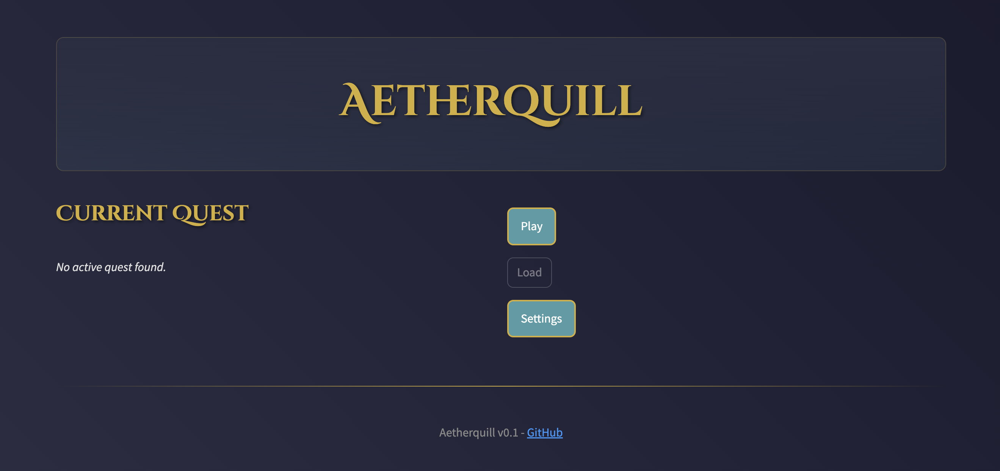
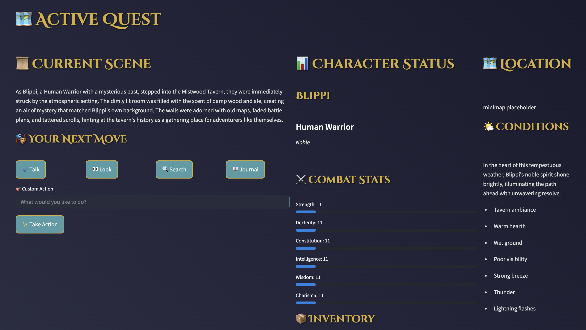

# Aetherquill

  
  

## Overview

Aetherquill is a tabletop RPG where the story comes to life as you play! The world reacts to your choices, guiding you through quests and adventures that are different every time. Instead of following a pre-written script, the game adapts and responds to *you*.

## Current Status

Aetherquill allows you to create a character and experience a dynamic, AI-driven quest.

Here's what you can currently do:

-   **Create a Character:** Define your hero by choosing a name, race, class, and background. Distribute points to influence your character's core stats, and select skills to define their abilities.
-   **Embark on an AI-Generated Quest:** The game leverages Ollama to create scenes, dialogues, and quest events based on your character and choices.
-   **Influence the Narrative:** Interact with the world through actions like talking, observing, and performing custom actions that shape the story.
-   **View Character Sheet:** Displays key character information, including stats, skills, level, and experience.
-   **Explore and Interact with the World:** Start questing and experience a world that responds to your actions. The game saves your progress.

We're currently working on:

1.  Combat System Enhancements
2.  Further Narrative and Quest Refinement
3.  Inventory System

Want to know more? Check out the [Roadmap](docs/Roadmap.md).

## System Architecture

-   **Frontend:** A web-based interface (easy to use in your browser).
-   **Backend:** The engine that powers the game.
-   **Ollama:** The "Storyteller" that generates the story.
-   **Storage:** Saves your game so you can come back later.

## Component Dependencies

-   The Core Game needs the Save System to work.
-   The UI needs the Core Game to display information.
-   The Storyteller needs the Core Game to create stories.

## Technical Requirements

1.  Python 3.8 or higher
2.  Streamlit 1.10 or higher
3.  Ollama

## Performance Requirements

-   Ollama model should respond in less than 2 seconds.
-   The UI should feel smooth and responsive while following the [style guide](docs/Styleguide.md)
-   Saving and loading should be quick (less than 5 seconds).
