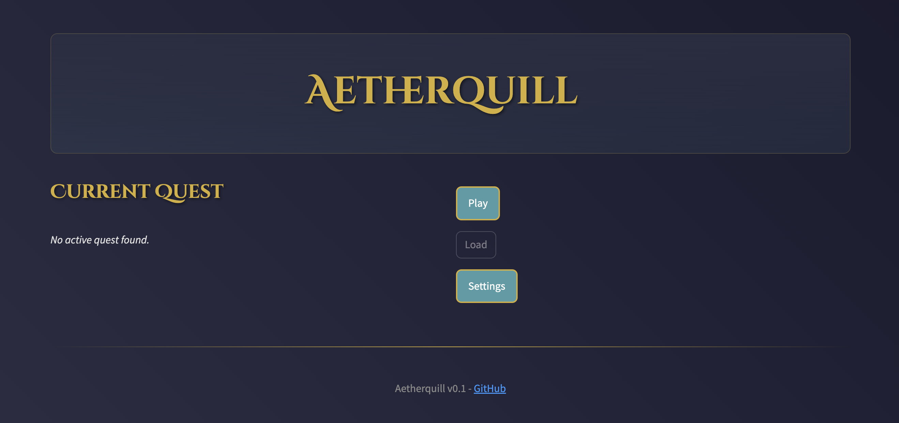
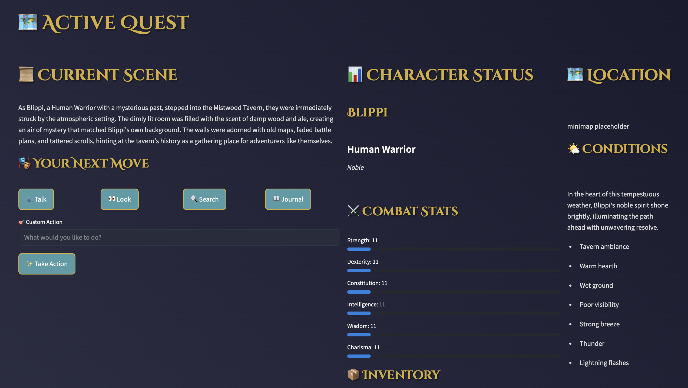

# Aetherquill

  
  

## Overview

Aetherquill is a tabletop RPG where the story comes to life as you play! The world reacts to your choices, guiding you through quests and adventures that are different every time. Instead of following a pre-written script, the game adapts and responds to *you*.

## Current Status

Aetherquill lets you create your own hero and jump into a world that's shaped by your actions.

Here's what you can do right now:

-   **Create Your Character:** Choose a name, race, class, and background. These choices influence the kind of stories you'll experience.
-   **Explore an Ever-Changing Story:** The game uses a smart storytelling system to create scenes, conversations, and quests based on how you describe your character, and what *you* choose to do.
-   **Save Your Progress:**  Pick up where you left off and continue your unique adventure.
-   **Engage in Simple Combat:** Face enemies, roll for initiative, and resolve basic attacks.
-   **Navigate a Simple World:** Use the UI to begin questing.

We're currently working on:

1.  Character Development and Customization System
2.  Combat Initiative System
3.  Inventory System
4.  Story/Quest System

Want to know more? Check out the [Roadmap](docs/Roadmap.md).

## System Architecture

-   **Frontend:** A web-based interface (easy to use in your browser).
-   **Backend:** The engine that powers the game.
-   **Ollama:** The "Storyteller" that generates the story.
-   **Storage:** Saves your game so you can come back later.

## Component Dependencies

-   The Core Game needs the Save System to work.
-   The UI needs the Core Game to display information.
-   The Storyteller needs the Core Game to create stories.

## Technical Requirements

1.  Python 3.8 or higher
2.  Streamlit 1.10 or higher
3.  Ollama

## Performance Requirements

-   Ollama model should respond in less than 2 seconds.
-   The UI should feel smooth and responsive while following the [style guide](docs/Styleguide.md)
-   Saving and loading should be quick (less than 5 seconds).
