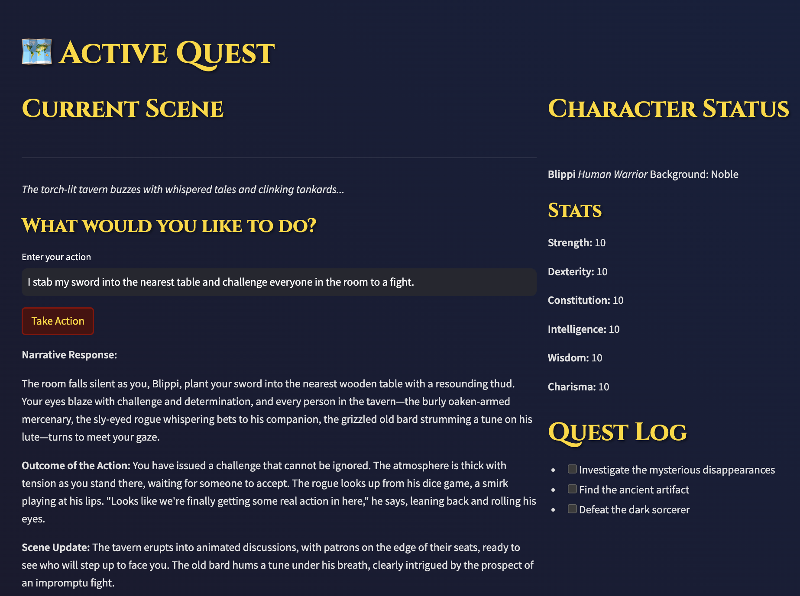

# Aetherquill

## Overview & Current Status

I am building a prototype of an AI-driven tabletop RPG system. Right now, it has a functional main menu with a medieval fantasy theme and working navigation between different sections. Players can create characters by choosing their race, class, and background, and set their core stats like strength and dexterity. The system can check if the AI (Ollama) is connected and ready to go.

What's working so far:
- A stylish dark fantasy interface with gold accents and medieval fonts
- Character creation with races (Human, Elf, Dwarf, etc.), classes (Warrior, Mage, Rogue, etc.), and backgrounds
- Stat allocation system for character attributes
- Navigation between the main menu, character creation, and quest screens
- Basic quest log display
- Game settings page with options for difficulty, text speed, and audio (though not hooked up yet)
- Connection status checking for the AI system

My next priorities are:
1. Get the AI story generation working - this is the core feature that will make the game special
2. Implement saving and loading of characters and game states
3. Build out the actual gameplay loop with the turn system and action resolution
4. Add proper error handling and response parsing for the AI integration

The game has a solid foundation now, but the real magic will happen once I get the AI storytelling integrated. That's why I'm focusing on the Ollama integration next - it'll bring the whole experience to life.

For more information, consult the [Roadmap](Roadmap.md).

## System Architecture
- Frontend: Streamlit web interface
- Backend: Python-based game engine
- AI: Ollama for narrative generation
- Storage: File-based with JSON serialization

## Component Dependencies
- Core Engine → State Management
- State Management → Save System
- AI Integration → Core Engine
- UI Components → State Management

## Technical Requirements
1. Python 3.8+
2. Streamlit 1.10+
3. Ollama API endpoint
4. Access to file system for saves

## Development Environment
- VS Code with Python extension
- Git for version control
- Virtual environment
- Local Ollama instance

## Data Flow
1. User Interface → Action Handler
2. Action Handler → Game Engine
3. Game Engine → AI Generator
4. AI Generator → State Manager
5. State Manager → User Interface

## API Endpoints
- /api/generate: Ollama story generation
- /api/save: Game state persistence
- /api/load: Game state restoration

## Testing Strategy
1. Unit tests for core logic
2. Integration tests for AI
3. UI tests with Streamlit
4. Save/load verification

## Deployment Strategy
1. Local development setup
2. Containerized testing
3. Production deployment
4. Monitoring implementation

## Performance Requirements
- < 2s response for AI generation
- < 1s for state updates
- < 100ms for UI updates
- < 5s for save/load
