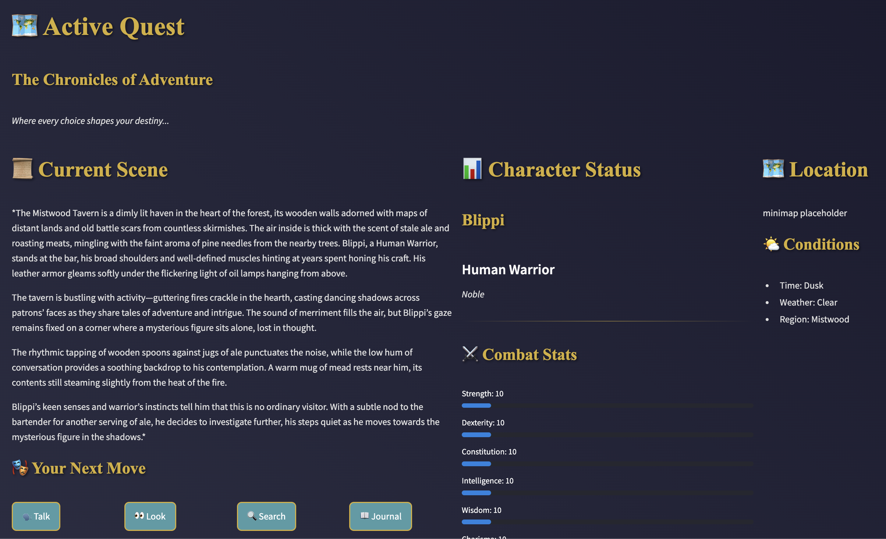

# Aetherquill

## Overview & Current Status

Aetherquill is an AI-driven tabletop RPG system. It writes the story as you engage with the game world, guiding you through quests and adventures. The system has achieved several major milestones:

- Robust AI Integration: Enhanced context management and response structuring
- Advanced State Management: Comprehensive game state tracking and persistence
- Improved UI Framework: Streamlined interface with better navigation and feedback
- Character System: Functional character creation and management
- Quest System: Basic quest tracking and progression

Recent improvements include:
- Enhanced context awareness and history management
- Standardized response formatting
- Improved state validation and transitions
- Expanded character creation interface
- Better navigation and menu systems

Current focus areas:
1. Combat system implementation
2. Inventory management
3. Enhanced quest generation
4. Save/load system refinement

For more information, consult the [Roadmap](docs/Roadmap.md).

## System Architecture
- Frontend: Streamlit web interface
- Backend: Python-based game engine
- AI: Ollama for narrative generation
- Storage: File-based with JSON serialization

## Component Dependencies
- Core Engine → State Management
- State Management → Save System
- AI Integration → Core Engine
- UI Components → State Management

## Technical Requirements
1. Python 3.8+
2. Streamlit 1.10+
3. Ollama API endpoint
4. Access to file system for saves

## Development Environment
- VS Code with Python extension
- Git for version control
- Virtual environment
- Local Ollama instance

## Data Flow
1. User Interface → Action Handler
2. Action Handler → Game Engine
3. Game Engine → AI Generator
4. AI Generator → State Manager
5. State Manager → User Interface

## API Endpoints
- /api/generate: Ollama story generation
- /api/save: Game state persistence
- /api/load: Game state restoration

## Testing Strategy
1. Unit tests for core logic
2. Integration tests for AI
3. UI tests with Streamlit
4. Save/load verification

## Deployment Strategy
1. Local development setup
2. Containerized testing
3. Production deployment
4. Monitoring implementation

## Performance Requirements
- < 2s response for AI generation
- < 1s for state updates
- < 100ms for UI updates
- < 5s for save/load
