<style>
section {
  font-family: "Quattrocento Sans", Arial, sans-serif;
  color: #FFFFFF;
}

h1, h2, h3 {
  font-family: "Cinzel", "Times New Roman", serif;
  color: #D4AF37;
}
</style>

# **Aetherquill**
Functional Flow Overview
*Where Imagination Takes Flight*

---

# App Initialization

This diagram illustrates the initial steps taken when the Aetherquill application starts, from setting up the user interface to rendering the main menu.

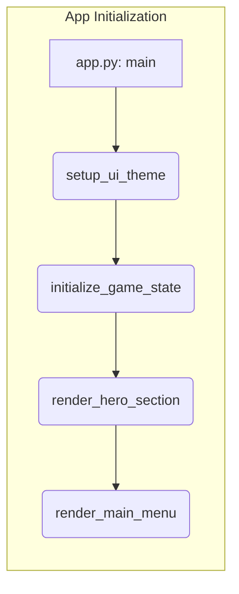

---

# Main Menu

The Main Menu flow details the user's options: starting a new game, loading an existing one, or adjusting settings.


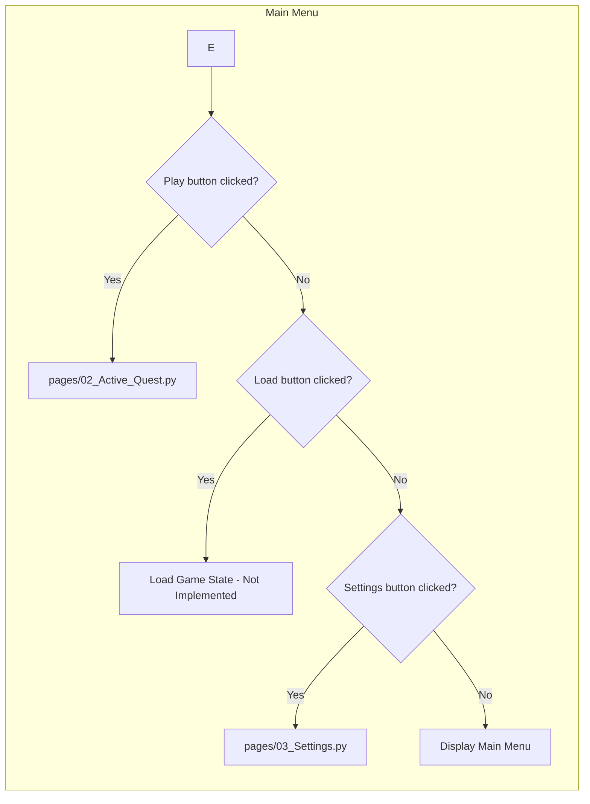

---

# Incomplete Feature: Load Game State

Currently, the 'Load Game State' functionality is under development. This feature will allow players to load previously saved adventures.

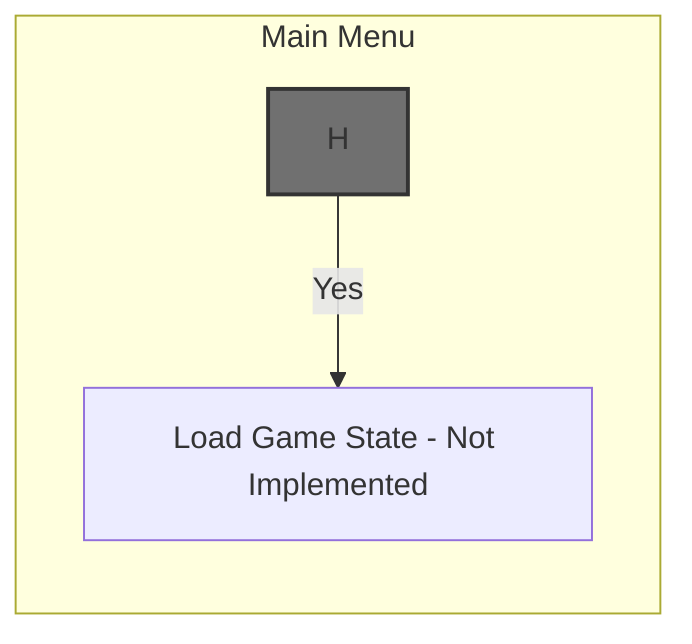

---

# Settings Menu

Users can access the Settings Menu to customize their experience. This includes options for audio, graphics, and keybindings.

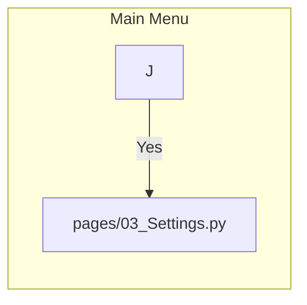

---

# Active Quest

The Active Quest flow outlines the steps taken when a player enters the main gameplay screen and begins their adventure.
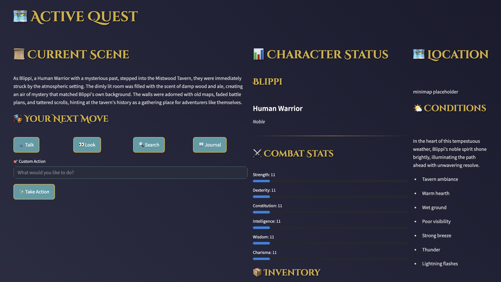

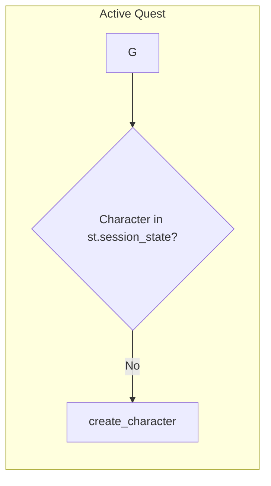

---

# Character Creation

This flow illustrates the character creation process, where players define their hero's attributes and background.
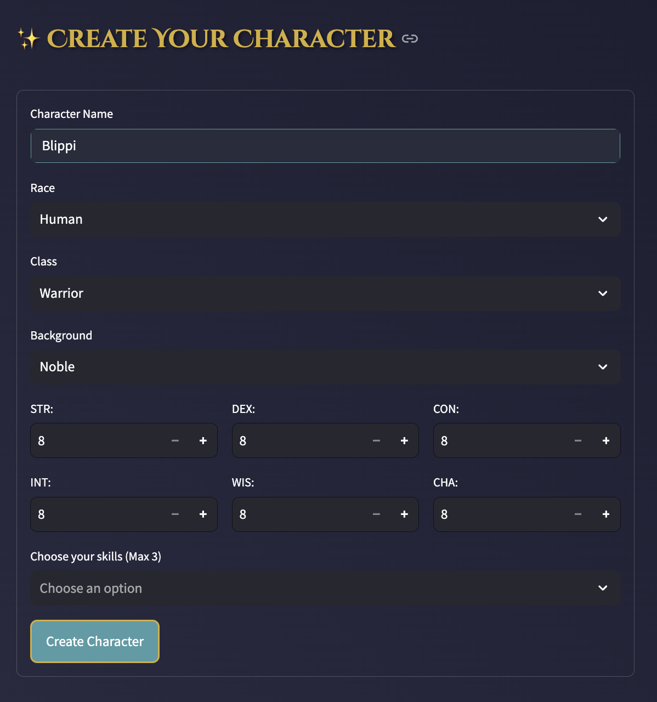

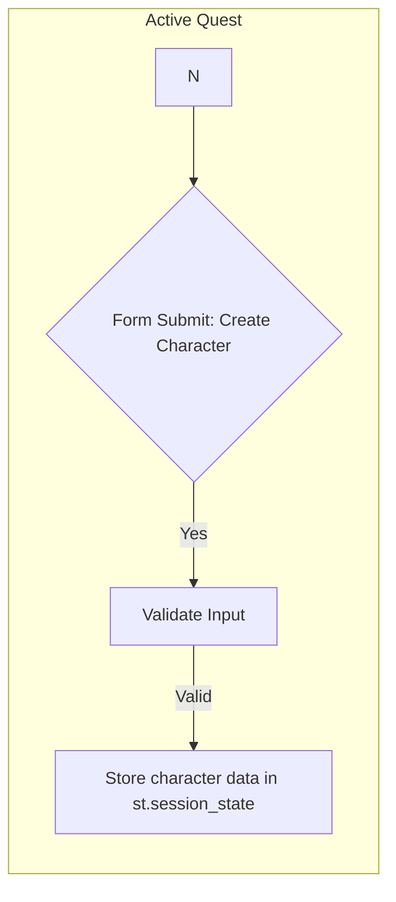

---

# Background Story Generation

After character creation, the system generates a unique background story using AI, providing a personalized narrative starting point.


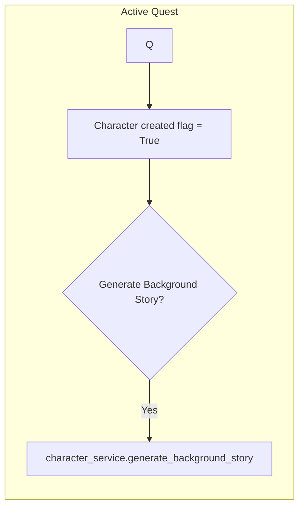

---

# Initial Scene Setup

The initial scene is set up, game state is initialized with the generated background story, and the game is saved, ensuring progress is not lost.

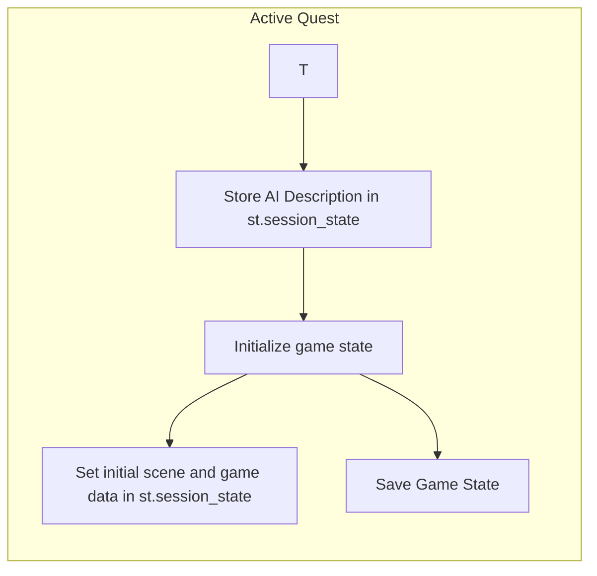

---

# Active Quest Interface

The main gameplay screen displays the character sheet and the active quest interface, providing players with the information they need to navigate their adventure.


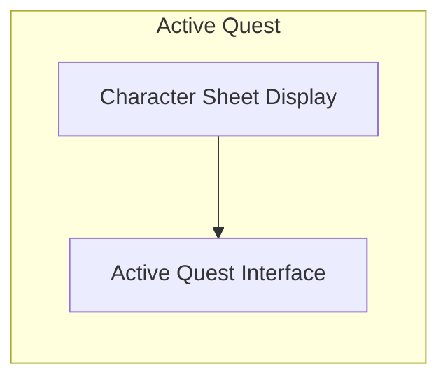

---

# Character Sheet Display

The Character Sheet, a key component of the Active Quest Interface, displays the player's stats, abilities, and equipment.

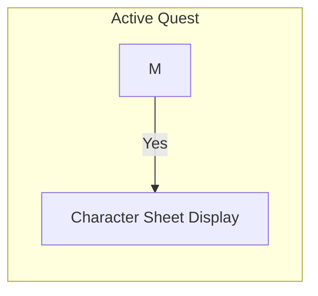

---

# Settings Interface

The Settings Interface allows users to customize their game settings, ensuring a comfortable and personalized gameplay experience.

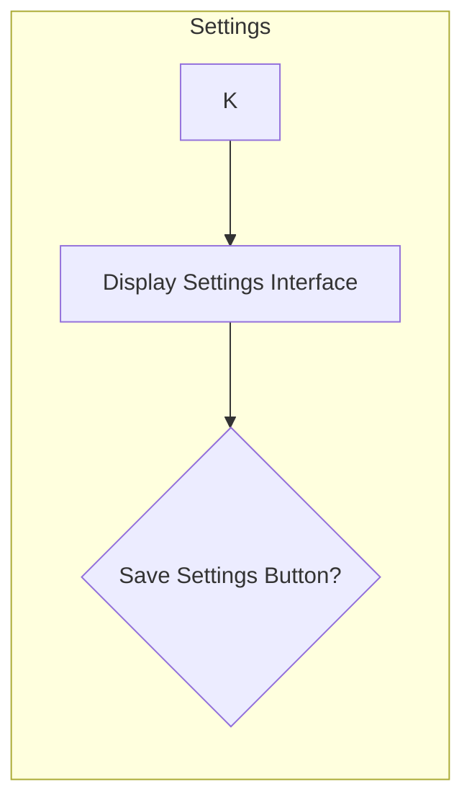

---

# Database Interactions

Game data, including character information, quest progress, and world state, is stored and retrieved from a SQLite database, providing persistence to the player's actions.

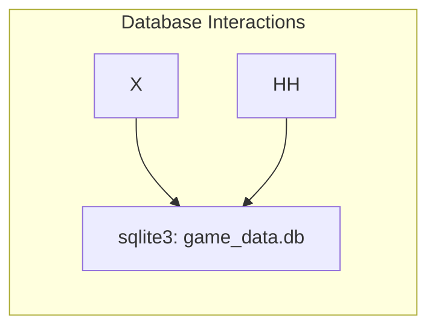

---

# AI Interactions

The game leverages AI for background story generation, creating unique and engaging starting points for each player's adventure.

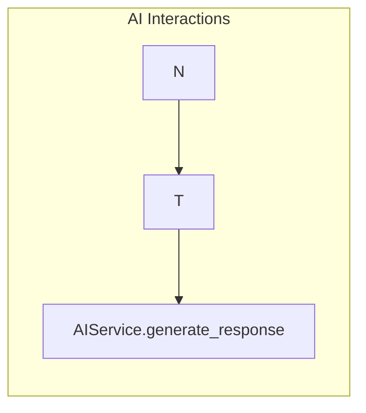

---

# **Summary**

Aetherquill blends a compelling gameplay loop with dynamic story generation, persistent data storage, and engaging AI interactions, creating a unique and immersive RPG experience.
```
